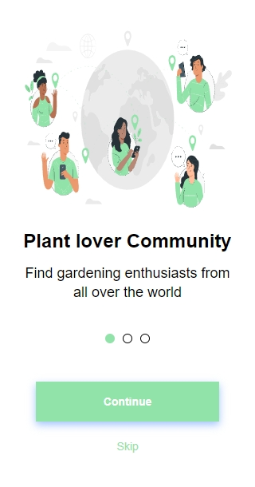
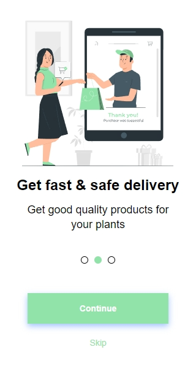
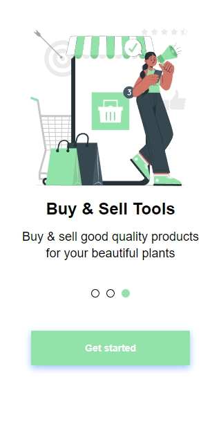

# Sobre
---
This project was created to improve knowledge in React, it was used as a reference the figma design <a href="https://www.figma.com/file/5DNfiBPHBxPNBmajKmPcrr/Onboarding-(Community)?node-id=0%3A1&t=R77R4Uryp06ewyya-0">link</a>
<br>
<h5 >Reference designation:</h5>


---
## Navegando pela aplicação

Antes de tudo, é necessário ter o NodeJS e o NPM instalado em seu computador. Basta instalar através desse <a href="https://nodejs.org/en/">link</a>.

---

Abra o terminal no diretório em questão e execute o seguinte comando:

```
npm install
```

Para rodar a aplicação em seu computador, utilize o comando:

```
npm start
```
## Página inicial
<figure width="100%" display="flex"
justify-content='center'  align="center">

</figure>

## Segunda página

<figure width="100%" display="flex"
justify-content='center'  align="center">

</figure>

## Terceira Página

<figure width="100%" display="flex"
justify-content='center'  align="center"/>

</figure>

---
# :computer: Tecnologias


 
  
    
         

